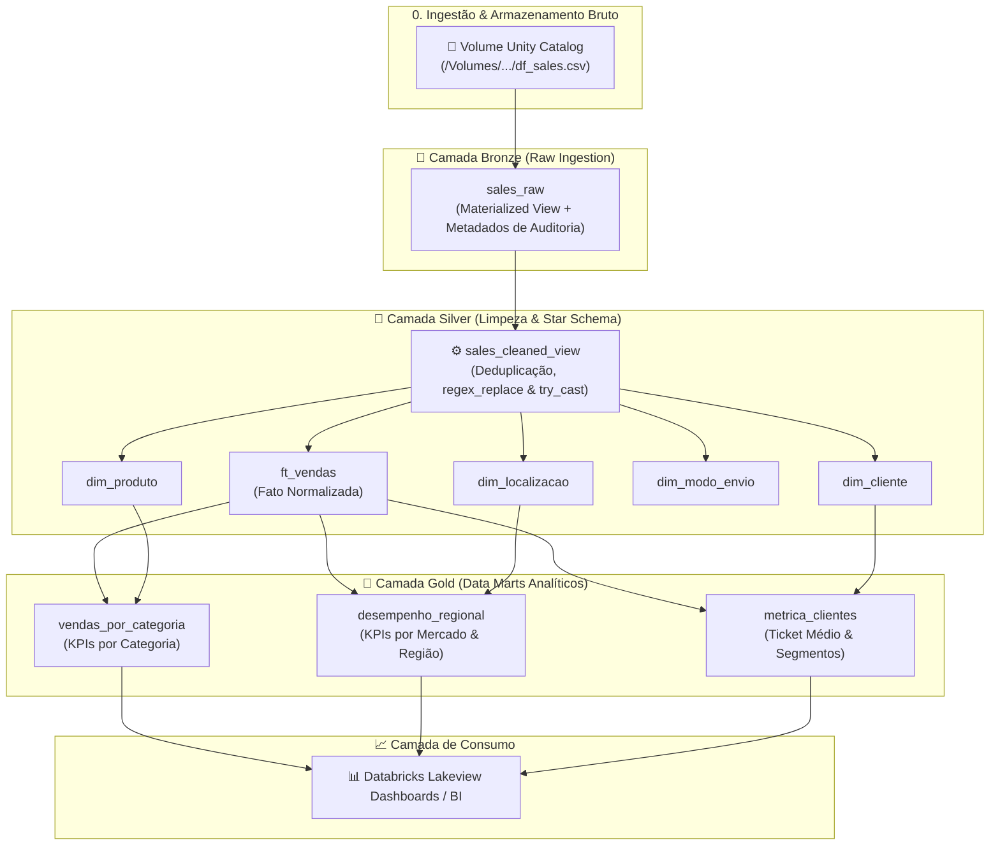
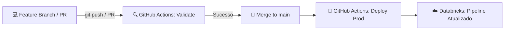

# 📊 Enterprise Lakehouse Platform: Medallion Architecture & DataOps with Databricks


Este projeto implementa uma solução completa de **Engenharia de Dados em Nuvem (Lakehouse)** utilizando o **Databricks**, seguindo a arquitetura medalhão (**Bronze $\rightarrow$ Silver $\rightarrow$ Gold**), governança centralizada no **Unity Catalog**, validação automatizada de qualidade com **Delta Live Tables (DLT Expectations)** e esteira de **CI/CD / DataOps** via **Databricks Asset Bundles (DABs)**.

---

## 🏗️ Arquitetura da Solução



---

## 🛡️ Governança & Data Quality (DLT Expectations)

Para garantir confiabilidade aos times de negócio e analistas, o pipeline possui regras ativas de qualidade de dados integradas ao fluxo de execução:

| Camada | Tabela | Regra de Qualidade | Tipo | Objetivo de Negócio |
| :--- | :--- | :--- | :--- | :--- |
| **Bronze** | `sales_raw` | `valid_primary_keys` | `@dlt.expect_or_drop` | Descartar registros sem `order_id` ou `product_id`. |
| **Bronze** | `sales_raw` | `valid_source_file_metadata` | `@dlt.expect` | Monitorar metadados de rastreabilidade de origem. |
| **Silver** | `ft_vendas` | `valid_positive_sales` | `@dlt.expect_or_drop` | Garantir que o valor das vendas seja estritamente positivo. |
| **Silver** | `ft_vendas` | `valid_positive_quantity` | `@dlt.expect_or_drop` | Filtrar quantidades $\le 0$. |
| **Silver** | `ft_vendas` | `valid_discount_range` | `@dlt.expect` | Monitorar descontos fora da faixa padrão (0 a 100%). |
| **Silver** | `ft_vendas` | `valid_dates_chronology` | `@dlt.expect` | Validar se a data de envio é posterior/igual à data do pedido. |
| **Silver** | Dimensões | `valid_*_id` / `valid_location` | `@dlt.expect_or_drop` | Preservar integridade referencial nas dimensões. |
| **Gold** | Data Marts | `valid_*_revenue` | `@dlt.expect` | Assegurar integridade dos KPIs agregados de receita. |

### 📈 Resultados Reais de Qualidade de Dados:
* **Taxa de Conformidade:** **99,4%** (50.951 registros aprovados e materializados)
* **Anomalias Tratadas:** **0,6%** (301 registros inválidos/corrompidos descartados automaticamente na borda)

---

## 📦 Modelagem de Dados

### 1. Camada Silver (Modelagem Dimensional Star Schema)
* **`dim_produto`**: `product_id`, `product_name`, `category`, `sub_category`
* **`dim_cliente`**: `customer_name`, `segment`
* **`dim_localizacao`**: `country`, `state`, `region`, `market`
* **`dim_modo_envio`**: `ship_mode`, `order_priority`
* **`ft_vendas`**: Fato com chaves dimensionais e métricas (`sales`, `quantity`, `discount`, `profit`, `shipping_cost`, `margem_lucro`, `_updated_at`).

### 2. Camada Gold (Data Marts de Negócio)
* **`vendas_por_categoria`**: Agregação de faturamento, margem média e volume por categoria e subcategoria de produto.
* **`desempenho_regional`**: Análise geográfica de lucratividade, volume de vendas e custos logísticos por país e região.
* **`metrica_clientes`**: Indicadores de valor do cliente, faturamento por segmento e ticket médio por pedido.

---

## 🤖 DataOps: CI/CD com Databricks Asset Bundles (DABs)

O projeto é gerenciado como **Infraestrutura como Código (IaC)**, permitindo deploys automatizados entre ambientes de Desenvolvimento e Produção:



* **`databricks.yml`**: Configuração central do bundle com definição de targets (`dev`, `prod`).
* **`resources/pipeline.yml`**: Especificação declarativa do pipeline DLT (Serverless + Photon).
* **`.github/workflows/deploy.yml`**: Workflow de automação que valida os bundles em PRs e faz deploy automático na branch `main`.

---

## 💻 Como Executar Localmente

### Pré-requisitos
* [Databricks CLI](https://docs.databricks.com/dev-tools/cli/index.html) instalado e configurado
* Python 3.10+
* Acesso a um workspace Databricks com Unity Catalog ativado

### 1. Clonar o Repositório
```bash
git clone https://github.com/SEU_USUARIO/SEU_REPOSITORIO.git
cd SEU_REPOSITORIO
```

### 2. Validar as Definições do Bundle
```bash
databricks bundle validate -t dev
```

### 3. Fazer o Deploy para o Databricks
```bash
databricks bundle deploy -t dev
```

### 4. Executar o Pipeline
```bash
databricks bundle run portfolio_lakehouse_pipeline -t dev
```

---

## 🛠️ Tecnologias e Ferramentas

* **Compute & Storage:** Databricks Serverless, Photon Engine, Apache Spark (PySpark), Delta Lake
* **Governança & Catálogo:** Unity Catalog (Catalogs, Schemas, Volumes, Managed Tables, Materialized Views)
* **Orquestração & Pipeline:** Delta Live Tables (DLT / Lakeflow)
* **DataOps & CI/CD:** Databricks Asset Bundles (DABs), GitHub Actions, Git
